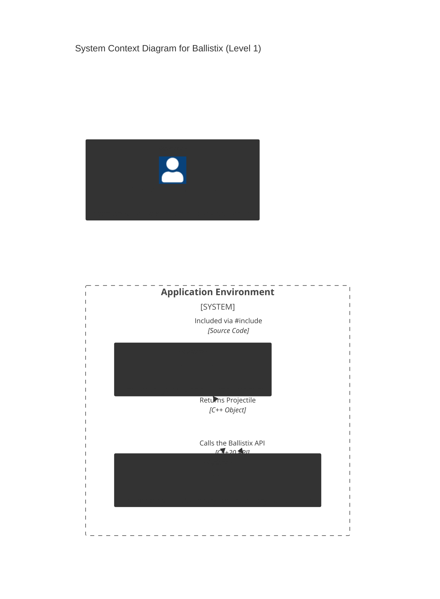

# 3. Context and Scope

Ballistix is a pure C++20 header-only library. This chapter defines the boundaries between the internal calculation logic, the integrating host application, and the toolchain.

## 3.1 Business Context

## 3.2 Technical Context

The integration of **Ballistix** occurs at the source code level. Since it is a header-only library, there is no binary linkage at runtime; the library is compiled directly as part of the host application.

| Neighbor / System | Technical Interface | Details / Protocol |
| :--- | :--- | :--- |
| **Host Application** | C++ Source API | Included via `#include "Ballistix/Ballistix.hpp"`. Data is exchanged via in-memory objects (e.g., `Vector3`, `Projectile`). |
| **C++ Compiler** | ISO C++20 | Requires a compiler with full C++20 support (e.g., for [Concepts](https://cppreference.com) and [std::numbers](https://cppreference.com)). |
| **Build System** | Header-only (CMake) | No linking step required. Can be integrated via simple include path configuration. |

**Technical Constraints & Characteristics:**

*   **Zero External Dependencies:** Ballistix relies solely on the [C++ Standard Library (STL)](https://cppreference.com). No third-party math libraries are required.
*   **Memory Management:** The library avoids dynamic memory allocation (no `new`/`delete`) to ensure deterministic behavior in real-time environments like games or simulators.
*   **Variable Floating Point Precision:** All core types (like `Vector3<T>`) are implemented using [C++ Templates](https://cppreference.com). This allows users to choose between `float` or `double`, depending on their performance and accuracy requirements.
*   **Compile-Time Type Safety:** Using [C++20 Concepts](https://cppreference.com), the library ensures at compile-time that only appropriate numeric types are used for ballistic calculations.